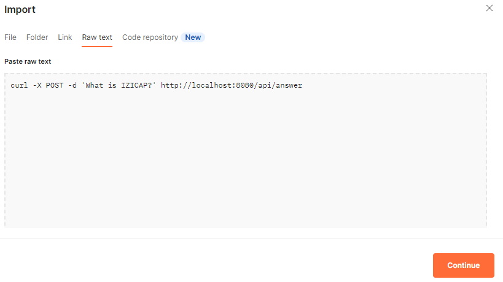
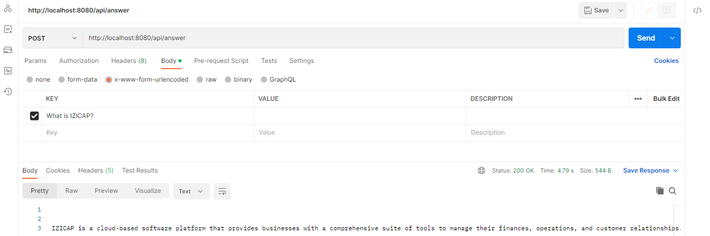
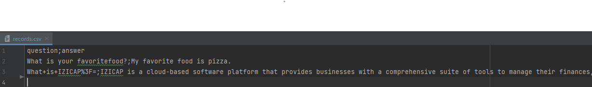

# Completion OpenAI Microservice

A simple completion OpenAI microservice  built with Spring Boot and Docker.

## Getting started

### Prerequisites
- Java Development Kit (JDK) 17 or higher installed
- Docker installed and running on your machine
- Basic knowledge of Java, Spring Boot, and Docker

To run the microservice, you need to have Docker installed on your machine. Then, follow these steps:

1. Clone the project in your local machine 
2. Get your OpenAI key from here https://platform.openai.com/account/api-keys , add it config.RequestConfig, you can also update the path to csv file for question;answer records. 
3. Build the Maven project: Navigate to the root directory of the cloned repository and execute the following command in a terminal or command prompt:  `mvn clean install`
4. Open a terminal window and navigate to the root directory of the project.
5. Build the Docker image by running the following command: `docker build -t completion-chatgpt .`
6. Start the Docker container by running the following command: `docker run -p 8080:8080 completion-chatgpt`
7. Open a web browser and navigate to "http://localhost:8080/swagger-ui.html" to see the API documentation.
8. Open a web browser and go to http://localhost:8080/actuator/health to check the health status of the application, you can use other fonctionnalities of actuator. 
9. Test of the microservice
- Curl request in postman

- Saving records of question;answer in records.csv file

## API documentation

The API documentation is generated with Swagger. To see the documentation, open a web browser and navigate to "http://localhost:8080/swagger-ui.html".

## License

This microservice is licensed under the MIT License. See the LICENSE file for more information.